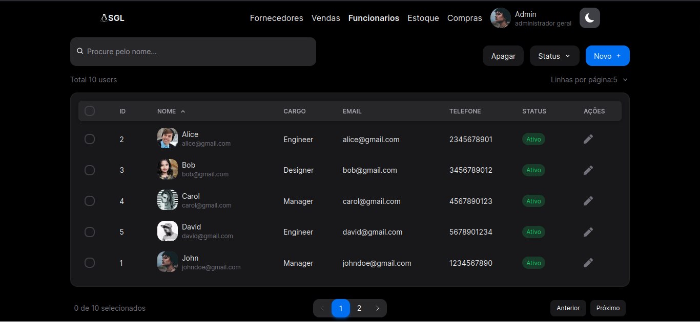

# Gerenciamento Loja

This is a comprehensive guide for the "Gerenciamento Loja" project in Nextjs, an example application that implements the basic styling and api integration.

## Information

- **Title**: Gerenciamento Loja
- **Version**: 1.0
- **Preview**:

  

## Prerequisites

Before getting started, make sure you have the following prerequisites installed on your system:

- [Node](https://nodejs.org/): Javascript runtime.
- [PNPM](https://pnpm.io/): Package manager.
- [Docker](https://www.docker.com/get-started): Plataform to run container applications

## Installation

Follow the steps below to install the project in your development environment:

1. **Clone the repository:**

   ```
   git clone https://github.com/LucasTravessa/Gerenciamento-loja.git
   ```

2. **Navigate to the project directory:**

   ```
   cd Gerenciamento-loja
   ```

3. **Installing the packages(with PNPM installed on your machine):**

   ```
   pnpm install
   ```

4. **Running the container with the database:**

   ```
   docker run --name sgl-db -e POSTGRES_PASSWORD=postgres -e POSTGRES_USER=postgres -e POSTGRES_DB=loja -p 5432:5432 -d postgres:alpine
   ```

5. **Running the prisma migrations(don't forget to setup the .env file):**

   ```
   pnpm db:push
   ```

6. **Running the database seed:**

   ```
   pnpm db:seed
   ```

## Running the Application

After installation, you can run the Gerenciamento Loja application with the following command:

```
pnpm start
```

The application will be accessible at: [localhost:3000](http://localhost:3000/)

## Used technologies:

This is a [T3 Stack](https://create.t3.gg/) project bootstrapped with `create-t3-app`.

- [Next.js](https://nextjs.org)
- [NextAuth.js](https://next-auth.js.org)
- [Prisma](https://prisma.io)
- [Tailwind CSS](https://tailwindcss.com)
- [tRPC](https://trpc.io)